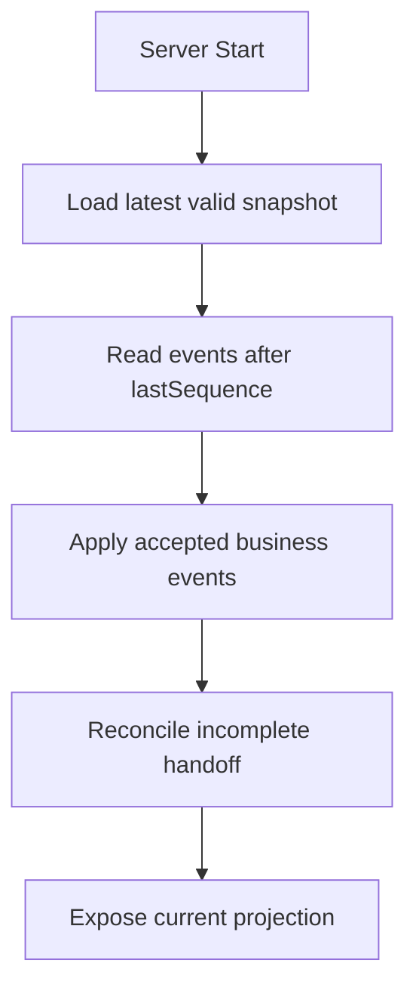

# Task 11：Event Ledger 与状态恢复设计 Spec

## 1. 文档状态

- 状态：Ready for implementation after Task 10
- 前置任务：Task 9、Task 10
- 后续依赖：Task 12、Task 13、Task 14

## 2. 目标

把当前只存在于 Vite 进程内存中的业务事件保存为可恢复、可审计的本地 Event Ledger，并在服务重启后恢复 Office Projection。

恢复投影不等于播放历史动画。历史完成态必须瞬时恢复，只允许继续尚未完成的当前交接。

## 3. 非目标

- 不建设分布式消息队列。
- 不建设多租户数据库。
- 不做事件编辑或删除 UI。
- 不引入云服务。
- 不持久化每个动画帧和人物坐标。
- 不把 ledger 原始内容展示在 Office Summary。

## 4. 存储策略

第一版使用 JSONL 事件账本加原子 Snapshot 文件，避免为本地原型引入数据库服务。

默认目录：

```text
apps/office-demo/.data/
  office-events.jsonl
  office-snapshot.json
  rejected-events.jsonl
```

`.data` 必须加入 `.gitignore`，测试使用临时目录。

## 5. 存储接口

领域层不得直接访问文件系统。

```ts
interface EventLedger {
  append(event: PersistedBusinessEvent): Promise<AppendResult>;
  readAfter(sequence: number): AsyncIterable<PersistedBusinessEvent>;
  findByEventId(eventId: string): Promise<PersistedBusinessEvent | null>;
  appendRejected(record: RejectedEventRecord): Promise<void>;
  close(): Promise<void>;
}

interface ProjectionSnapshotStore {
  load(): Promise<PersistedProjectionSnapshot | null>;
  save(snapshot: PersistedProjectionSnapshot): Promise<void>;
}
```

提供：

- `InMemoryEventLedger`：单元测试和纯领域测试。
- `JsonlEventLedger`：本地运行。
- `JsonProjectionSnapshotStore`：本地快照。

## 6. 持久化记录

```ts
type PersistedBusinessEvent = {
  sequence: number;
  epoch: number;
  receivedAt: string;
  envelope: BusinessEventEnvelope<string, unknown>;
};
```

- sequence 在单个 ledger 内严格递增。
- epoch 由 `projection.reset` 增加。
- occurredAt 保留来源时间。
- receivedAt 是网关接收时间。
- eventId 在所有 epoch 中保持唯一。

## 7. 写入事务顺序

处理新业务事件：

1. 解析并验证 envelope。
2. 检查 eventId 幂等。
3. 在当前 projection 的副本上应用事件。
4. 如果领域转换失败，写入 rejected ledger，原状态不变。
5. 将 accepted event 追加到 ledger 并 flush。
6. 只有 append 成功后，提交新的内存 projection。
7. 生成响应并通知订阅者。
8. 按策略写 snapshot。

禁止先修改内存状态再尝试落盘。

## 8. Snapshot

```ts
type PersistedProjectionSnapshot = {
  formatVersion: 1;
  epoch: number;
  lastSequence: number;
  savedAt: string;
  projection: OfficeSnapshot;
  idempotencyIndex: Record<string, string>;
};
```

保存策略：

- 每 20 个 accepted business events 保存一次。
- `projection.reset` 后立即保存。
- 服务正常关闭前保存。
- 使用临时文件写完后原子 rename，避免半文件。

idempotencyIndex 的 value 是 envelope 内容的稳定 hash，用于区分相同 eventId 的重复和冲突。

## 9. 启动恢复



规则：

- 已完成事件直接得到最终状态，不播放历史 motion。
- submitted 但未 delivered 的 Artifact 恢复为一条待继续的 producer delivery motion。
- accepted 但未 received 的 Artifact 恢复为一条待继续的 assignee collection motion。
- 同时存在多个未完成交接时，按 ledger sequence 重建 FIFO。
- 如果 snapshot 无效，回退到从 ledger sequence 1 重建。
- 如果 JSONL 最后一行因异常中断而不完整，隔离该行、记录诊断并恢复之前的合法事件。
- 中间行损坏不得静默跳过，服务进入 degraded 状态并停止接受新业务事件。

恢复必须使用显式模式，禁止历史事件重新创建 presentation motion：

```ts
type ApplyMode = 'live' | 'recovery';

applyBusinessEvent(state, event, { mode: 'recovery' });
```

- `live` 模式允许根据新业务事件创建 motion。
- `recovery` 模式只重建业务 Projection，不产生历史 motion。
- 全部事件应用完成后，由 reconciliation 根据最终未完成状态最多重建当前必要 motion 和 FIFO 队列。

## 10. Reset 语义

Reset Projection 不删除历史文件。

它追加 `projection.reset`：

- epoch 加 1。
- 创建新的初始 Office Projection。
- 取消当前 motion 和 timer。
- 旧 epoch 的事件仍可审计，但不参与当前 projection。
- Task 14 的 diagnostics 可以显示当前 epoch，不在 Office Summary 展示。

测试环境可提供显式 `clearStorage()`，生产接口不得暴露物理删除。

## 11. Rejected Event

```ts
type RejectedEventRecord = {
  rejectedAt: string;
  eventId?: string;
  eventType?: string;
  sourceSystem?: string;
  reasonCode: string;
  message: string;
  payloadHash: string;
};
```

第一版不在 rejected ledger 保存完整 Artifact evidence，避免无边界复制潜在敏感内容。

## 12. 文件与并发

- 单进程内用串行 Promise queue 保护 append 和 projection commit。
- 不允许两个请求同时分配相同 sequence。
- 文件句柄在 server dispose 时关闭。
- 每行 JSON 限制最大字节数。
- 写入失败返回 503，状态不得前进。
- 测试不得使用真实 `.data` 目录。

## 13. 与 Vite Plugin 的关系

- Vite plugin 只负责 HTTP 适配。
- Store、ledger、recovery 和 reducer 放在与 Vite 无关的 backend/domain 模块。
- Task 13 可直接复用这些模块创建独立 gateway server。
- `createOfficeApiStore()` 改为接受 storage 和 clock 依赖，测试不依赖全局时间和真实磁盘。

## 14. 测试

必须覆盖：

- append 后重启恢复。
- snapshot + 增量事件恢复。
- 无 snapshot 全量恢复。
- 重复 eventId。
- 相同 eventId 不同 payload 冲突。
- append 失败时 projection 不变。
- Reset 新 epoch 与旧事件保留。
- 尾行损坏恢复。
- 中间行损坏进入 degraded。
- submitted 未 delivered 恢复。
- accepted 未 received 恢复。
- 多交接 FIFO 恢复。
- 所有测试使用临时目录并清理。

## 15. 验收标准

- 服务重启后 Artifact、Active Work、Hub count、通知和 Latest Handoff 正确恢复。
- 历史动画不重新播放。
- 仅恢复未完成的当前交接。
- Reset 后当前 projection 清空，但 ledger 历史仍在。
- eventId 幂等跨重启有效。
- 文件写入失败不会产生幽灵状态。
- `.data` 不进入 Git。
- 原有 Event Console 与完整交接闭环通过。
- 全部测试、资产验证和构建通过。
