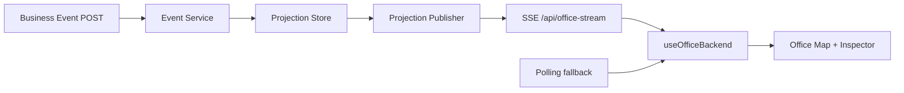

# Task 12：SSE 实时投影设计 Spec

## 1. 文档状态

- 状态：Ready for implementation after Task 11
- 前置任务：Task 9、Task 10、Task 11
- 后续依赖：Task 13、Task 14

## 2. 目标

使用 Server-Sent Events 将 Office Projection 主同步机制从 500ms 轮询升级为服务端实时推送，同时保留可控的轮询降级。

选择 SSE 而不是 WebSocket，因为当前主要通信方向是服务器向前端推送 Projection，业务事件仍通过普通 POST 提交。

## 3. 非目标

- 不通过 SSE 提交业务事件。
- 不发送动画每一帧坐标。
- 不支持双向聊天。
- 不增加外部鉴权。
- 不修改 Artifact 或事件业务语义。
- 不删除轮询降级能力。

## 4. 总体数据流



## 5. SSE Endpoint

```text
GET /api/office-stream
```

响应头：

```text
Content-Type: text/event-stream; charset=utf-8
Cache-Control: no-cache, no-transform
Connection: keep-alive
X-Accel-Buffering: no
```

连接建立后立即发送当前 Projection，不等待下一次变化。

## 6. 消息类型

### 6.1 `snapshot`

```text
id: <epoch>:<revision>
event: snapshot
data: {"epoch":2,"revision":18,"sequence":42,"snapshot":{...}}
```

```ts
type ProjectionStreamMessage = {
  epoch: number;
  revision: number;
  sequence: number;
  snapshot: OfficeSnapshot;
};
```

- epoch 来自 Task 11。
- revision 对当前 epoch 内每次 Projection 变化单调递增。
- sequence 是最后应用的持久化业务事件序号。
- motion 切换但未产生业务事件时 sequence 可以不变，revision 必须增加。

### 6.2 `heartbeat`

每 15 秒发送 SSE comment：

```text
: heartbeat 2026-07-22T04:00:00.000Z
```

Heartbeat 不增加 revision，不触发 React snapshot 更新。

### 6.3 `reset`

Reset 后仍发送 `snapshot`，通过新的 epoch 表达，不增加额外业务 UI 事件类型。

## 7. Publisher 接口

```ts
interface ProjectionPublisher {
  publish(message: ProjectionStreamMessage): void;
  subscribe(listener: (message: ProjectionStreamMessage) => void): () => void;
  latest(): ProjectionStreamMessage;
}
```

要求：

- Store 每次成功提交 Projection 后 publish。
- 发布发生在持久化成功之后。
- 订阅取消必须移除 listener。
- 单个慢客户端不能阻塞事件处理队列。
- Vite plugin 和 Task 13 Gateway 共用同一 publisher 接口。

## 8. 断线重连

浏览器使用原生 `EventSource`。

- 浏览器自动携带 `Last-Event-ID`。
- 服务端保留最近 100 个 Projection message 的内存 ring buffer。
- 如果 cursor 仍在 buffer 中，补发其后的 message。
- 如果 cursor 不存在或 epoch 已过期，只发送最新完整 snapshot。
- 不补播动画帧。
- 相同 `epoch:revision` 的消息必须被前端忽略。
- 更旧 epoch 或更低 revision 不得覆盖当前状态。

## 9. 前端同步状态机

```ts
type ProjectionConnectionState =
  | { mode: 'connecting'; failures: number }
  | { mode: 'sse'; failures: number; lastMessageAt: string }
  | { mode: 'polling'; failures: number; reason: string }
  | { mode: 'offline'; failures: number; reason: string };
```

规则：

- 首次连接优先 SSE。
- 连续 3 次 SSE 失败，或 10 秒内没有初始 snapshot，进入 polling。
- polling 使用现有顺序请求和旧响应保护。
- polling 每 5 秒尝试一次恢复 SSE，不同时维持两个活跃同步源。
- SSE 恢复并收到合法 snapshot 后停止 polling。
- POST 成功响应仍可立即 commit snapshot，后续相同 SSE revision 被忽略。
- 页面卸载时关闭 EventSource 和 timer。

## 10. Motion Runner 兼容

- Snapshot 重复到达不得重置当前 motion timer。
- 同一 motionId 只提交一次 `motion.completed`，失败时沿用现有重试。
- SSE 重连不得重新开始已经完成的 motion。
- 如果服务端恢复后返回新的 motionId，只继续未完成交接。
- `prefers-reduced-motion` 保持原行为。

## 11. 可见 UI

Task 12 不在 Office Summary 增加连接指标。

Hook 暴露 `connectionState`，Task 14 再在 Diagnostics 展示。当前只在整个 API 不可用时沿用 Inspector 错误提示。

## 12. 服务端资源管理

- 每个 SSE 连接注册 close listener。
- 客户端断开后清理 heartbeat timer 和 subscription。
- 服务 dispose 时关闭全部连接。
- 限制单 IP 并发连接数，开发默认 5。
- 写入 backpressure 持续出现时断开该客户端，让浏览器重连。

## 13. 测试

必须覆盖：

- 连接后立即收到 snapshot。
- accepted event 后收到新 revision。
- motion phase 变化也推送。
- heartbeat 不更新 React snapshot。
- Last-Event-ID buffer 补发。
- cursor 失效时发送最新 snapshot。
- 旧 epoch 和旧 revision 被忽略。
- 连续失败切换 polling。
- SSE 恢复后停止 polling。
- POST 响应与 SSE 同 revision 不重复执行。
- 组件卸载清理 EventSource 和 timer。
- motion runner 不重复确认。

## 14. 浏览器验收

- DevTools Network 中存在持续的 `office-stream`。
- 静置页面时不再每 500ms 请求 `office-state`。
- Event Console 提交后地图实时更新。
- 人工断开 SSE 后自动降级 polling。
- 恢复 SSE 后 polling 停止。
- Reset 后新 epoch 生效。
- 两个浏览器窗口同步看到相同 Projection。
- 无 `console.error`、`pageerror`、`unhandledrejection`。

## 15. 验收标准

- SSE 成为默认同步方式。
- polling 仅作为降级方案。
- 重连不重复业务事件、Artifact、Active Work 或动画。
- 多客户端获得一致 Projection。
- Event Console 和 Accept 的 POST 行为不变。
- 不修改 PNG 和视觉坐标。
- 全部自动化验证和浏览器验收通过。
