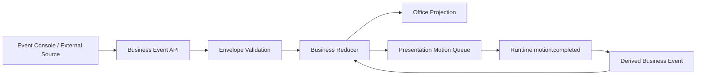

# Task 9：Business Event Contract v1 设计 Spec

## 1. 文档状态

- 状态：Ready for implementation
- 前置任务：Task 8 已完成并通过自动化验证
- 后续依赖：Task 10、Task 11、Task 12、Task 13、Task 14
- 目标应用：`apps/office-demo`

## 2. 目标

将当前由 React 和 Vite 内部约定的事件，升级为稳定、版本化、可由外部系统理解的业务事件契约。

完成后必须能够清楚回答：

1. 外部系统可以提交哪些事件。
2. 每个事件表达了什么已经发生的业务事实。
3. 哪些消息只是动画运行时信号，不属于业务事件。
4. 重复事件、乱序事件和非法事件如何处理。
5. 人工提交、Artifact 分配和下游接受之间是什么关系。

## 3. 非目标

本任务不实现：

- 磁盘持久化。
- SSE 或 WebSocket。
- 外部系统鉴权。
- Artifact 详细证据字段。
- 新地图、新角色或新动画。
- 员工屏幕、键鼠、窗口内容或 Agent 工具调用监控。

## 4. 核心决策

### 4.1 使用事件信封

所有可持久化业务事件采用统一信封：

```ts
type BusinessEventEnvelope<TType extends string, TPayload> = {
  eventId: string;
  eventType: TType;
  schemaVersion: '1.0';
  occurredAt: string;
  correlationId: string;
  causationId?: string;
  source: {
    system: string;
    actorId?: string;
  };
  payload: TPayload;
};
```

字段语义：

| 字段 | 语义 |
|---|---|
| `eventId` | 事件全局唯一标识，也是幂等键 |
| `eventType` | 已发生的业务事实 |
| `schemaVersion` | 事件结构版本，不使用应用版本代替 |
| `occurredAt` | 业务事实发生时间，ISO 8601 UTC 字符串 |
| `correlationId` | 一次完整业务交接链路的关联标识，根事件默认等于 eventId |
| `causationId` | 直接触发当前事件的上一事件 ID，根事件不填写 |
| `source.system` | 事件来源，例如 `event-console`、`pm-system` |
| `source.actorId` | 可选的人类或系统主体标识，不是桌位坐标 |
| `payload` | 与事件类型绑定的结构化数据 |

### 4.2 `artifact.submitted` 取代 `artifact.completed`

当前 `artifact.completed` 同时表示“产物完成、人工确认、提交并分配”。名称不够准确。

v1 对外使用 `artifact.submitted`，它表示：

> 人类已确认该岗位产出的 Artifact 可以离开当前 Workspace，并指定下游接收人。

因此：

- 点击 Event Console 的提交按钮等价于人工授权提交。
- 提交事件包含 producer 和 assignee。
- assignee 收到通知，但不会自动领取。
- `artifact.completed` 只在 Task 9 迁移适配器中接受，内部立即转换为 `artifact.submitted`，不得继续由新代码产生。

### 4.3 分配和接受保持分离

`artifact.submitted` 中包含 assignee，代表“分配给谁”。

`artifact.accepted` 代表下游员工主动接受。只有该事件发生后，领取动作才开始。

### 4.4 业务事件与运行时信号分离

业务事件：

- `artifact.submitted`
- `artifact.delivered`
- `artifact.accepted`
- `artifact.received`
- `projection.reset`

运行时信号：

- `motion.completed`

`motion.completed` 只说明某段前端表现已经结束，不得通过业务事件入口提交，也不得由 Event Console 展示或编辑。

运行时收到 `motion.completed` 后，由领域服务根据当前 motion phase 派生：

| Motion phase | 派生业务事件 |
|---|---|
| `producer-to-hub` | `artifact.delivered` |
| `producer-to-desk` | 不产生业务事件，只结束表现动作 |
| `assignee-to-hub` | 不产生业务事件，只切换 carry 表现 |
| `assignee-to-desk` | `artifact.received` |

派生事件使用确定性 ID，例如：

```text
<source-event-id>:delivered
<accept-event-id>:received
```

每个 presentation motion 必须保存 `causationEventId` 和 `correlationId`。运行时完成信号只携带 motionId，领域服务从当前 motion 取出因果信息，构造派生业务事件。

## 5. v1 事件定义

### 5.1 `artifact.submitted`

```ts
type ArtifactSubmittedPayload = {
  artifact: {
    id: string;
    category: 'prd' | 'feature' | 'report';
    title: string;
  };
  producerDeskId: string;
  assigneeDeskId: string;
};
```

约束：

- PRD：PM Office -> Dev Office。
- Feature：Dev Office -> QA Lab。
- Report：QA Lab -> PM Office。
- producer 和 assignee 必须在线且存在交接路线。
- title trim 后不能为空。
- artifact id 不能重复。

### 5.2 `artifact.delivered`

```ts
type ArtifactDeliveredPayload = {
  artifactId: string;
  producerDeskId: string;
};
```

该事件由系统产生，表示 Artifact 已进入 Hub，assignee 的 Accept 才能变为可用。

### 5.3 `artifact.accepted`

```ts
type ArtifactAcceptedPayload = {
  artifactId: string;
  assigneeDeskId: string;
};
```

该事件由员工详情中的 Accept 操作产生。Artifact 未 delivered、已被接受或分配给其他人时返回冲突。

### 5.4 `artifact.received`

```ts
type ArtifactReceivedPayload = {
  artifactId: string;
  assigneeDeskId: string;
};
```

该事件由系统产生，表示 Artifact 已到达接收人工位，并将对应工作加入 Active Work。

### 5.5 `projection.reset`

```ts
type ProjectionResetPayload = {
  reason: 'manual-reset';
};
```

它表示开始新的投影 epoch，不代表删除历史。Task 11 再实现持久化语义。

## 6. API 边界

### 6.1 业务事件入口

```text
POST /api/business-events
```

只接受 `BusinessEventEnvelope`。

成功响应：

```ts
type AcceptedEventResponse = {
  status: 'accepted' | 'duplicate';
  eventId: string;
  revision: number;
  snapshot: OfficeSnapshot;
};
```

状态码：

| 状态码 | 含义 |
|---:|---|
| 200 | 重复 eventId，返回已有处理结果 |
| 202 | 新事件已接受 |
| 400 | 信封或 payload 非法 |
| 404 | Artifact、员工或桌位不存在 |
| 409 | 状态冲突、错误路由、离线工位或重复 Artifact id |

### 6.2 运行时入口

```text
POST /api/runtime-events
```

只接受：

```ts
type MotionCompletedSignal = {
  type: 'motion.completed';
  motionId: string;
};
```

该入口仅供 Office 前端 motion runner 使用，不出现在 Event Console 的 Event Preview 中。

### 6.3 迁移

迁移期间保留 `/api/office-events` 兼容适配器，但满足以下约束：

- 只用于旧调用迁移。
- 新代码和新测试不得调用它。
- 旧 `artifact.completed` 被转换为 v1 `artifact.submitted`。
- Task 9 结束时记录删除兼容入口的后续条件。

## 7. 幂等与顺序

- `eventId` 是业务事件幂等键。
- 相同 eventId 和相同内容再次提交返回 `duplicate`。
- 相同 eventId 但内容不同返回 409。
- 不以 `occurredAt` 决定处理顺序，当前进程按接受顺序分配单调 revision。
- FIFO 只管理表现 motion，不改变业务事件接受顺序。
- 已处理 eventId 暂存在内存集合，Task 11 迁移到持久化 ledger。

## 8. 领域与表现分层



约束：

- UI 不直接写 Artifact location、Active Work 或 Hub count。
- Reducer 是业务状态唯一写入口。
- Motion runner 只报告 motion 是否完成。
- 业务事件类型不得依赖 React 组件。

## 9. Event Console 迁移

- 按钮从 `Complete and Assign` 改为 `Submit and Assign`。
- Event Preview 展示完整 v1 envelope。
- `source.system` 固定为 `event-console`。
- `occurredAt`、`eventId` 和 `correlationId` 由可注入 factory 产生，保证测试确定性。
- 成功文案保持“Business event received”，不写“动画开始”。
- Accept 同样提交 v1 `artifact.accepted` envelope。

## 10. 错误处理

- 前端保留表单输入并显示 API 返回的业务错误。
- 对 envelope 和 payload 分层报错。
- 不把内部堆栈返回给客户端。
- 派生事件失败时保持当前 motion 可重试，不制造半完成 Active Work。
- Reset 取消旧 timer，并阻止旧 revision 覆盖新 epoch。

## 11. 测试

必须新增或调整：

- v1 envelope 解析测试。
- 五种业务事件的 reducer 测试。
- legacy `artifact.completed` 迁移测试。
- eventId 重复及内容冲突测试。
- 错误 schemaVersion 测试。
- 业务入口拒绝 `motion.completed`。
- 运行时入口拒绝业务事件。
- submitted -> delivered -> accepted -> received 完整闭环。
- FIFO、多 Active Work、Reset 和旧响应保护回归测试。

## 12. 验收标准

- 新代码只产生 v1 业务事件。
- Event Console 不再产生 `artifact.completed`。
- `motion.completed` 与业务事件入口完全分离。
- 重复 eventId 不重复创建 Artifact、通知、Handoff 或 motion。
- Alice -> Jack 与 Jack -> Quinn 闭环继续通过。
- 原有视觉和 PNG 零修改。
- `npm test`、`npm run verify:assets`、`npm run build` 全部通过。
- 浏览器无 `console.error`、`pageerror`、`unhandledrejection`。
