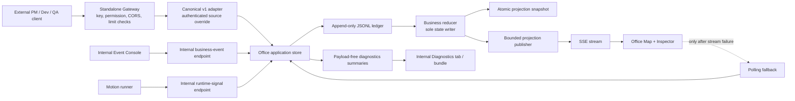

# Tasks 9–14 Event-Driven Office Execution Report

Date: 2026-07-23
Application: `C:\Users\29929\Desktop\AI-Wrokspace\apps\office-demo`

## Outcome

Tasks 9 through 14 are complete in the required order. The application now has a versioned and idempotent business-event contract, category-specific evidence, a durable JSONL projection with restart recovery, SSE-first synchronization, a standalone authenticated gateway, and internal privacy-safe runtime diagnostics.

| Task | Result | Delivered capability |
|---|---|---|
| 9 | Complete | Business Event Contract v1, derived-event causality, and separated business/runtime APIs |
| 10 | Complete | PRD, Feature, and Test Report evidence models, structured Console drafts, safe role-specific details |
| 11 | Complete | JSONL ledger, atomic snapshot, reset epochs, idempotent restart recovery, unfinished-motion reconciliation |
| 12 | Complete | SSE-first projection, cursor replay, stale-update guards, polling fallback and recovery |
| 13 | Complete | Independently runnable Node gateway, API-key identity/permissions, limits, probes, redacted logs, fixtures |
| 14 | Complete | Internal Diagnostics tab, health/runtime summaries, event outcomes, rejected rotation, redacted bundle |

## Final architecture and data flow



The reducer/application store is the only business-state mutation boundary. A business envelope is validated and deduplicated, appended before memory commit, reduced into a projection, snapshotted, and only then published. Presentation-only `motion.completed` signals are internal; they deterministically create durable `artifact.delivered` or `artifact.received` business facts when appropriate.

## Task 9 — Business Event Contract v1

The canonical envelope contains:

- `eventId`, `eventType`, `schemaVersion: "1.0"`, and `occurredAt`;
- `correlationId` and optional `causationId`;
- `source.system` and `source.actorId`;
- an event-specific `payload`.

The business-event union is `artifact.submitted`, `artifact.delivered`, `artifact.accepted`, `artifact.received`, and `projection.reset`. `motion.completed` is a separate runtime signal and is never accepted by the external event route.

`eventId` plus a stable envelope hash provides idempotency: an identical retry is `duplicate`, while the same ID with different content is a conflict. Derived events carry deterministic IDs and the original correlation/causation chain. Assignment remains distinct from acceptance, delivery is FIFO, and one person may retain multiple Active Work items. New UI code emits `artifact.submitted`. The temporary compatibility adapter used during Tasks 9-14 was removed by Task 15 after all callers and tests migrated to v1.

## Task 10 — Artifact Evidence

Evidence is discriminated by artifact category and revalidated at the API and domain boundaries:

| Category | Required structure |
|---|---|
| PRD | summary, priority, scope, user stories, acceptance criteria |
| Feature | summary, commits, changed-file count, build status/reference, optional safe preview URL, API contracts |
| Test Report | summary, result, test counts, optional coverage, regression result, bug summaries |

The Event Console exposes structured fields instead of a free-form JSON editor and clears category-specific drafts on category changes. Artifact Detail renders responsibility/status first and then the matching evidence panel using React text nodes. Empty optionals are omitted, external links are restricted to `http:`/`https:` with safe new-window attributes, and `dangerouslySetInnerHTML` is not used. Type/Source/Target/standalone Version, complete chat context, large code/log bodies, and employee-monitoring data are not displayed.

## Task 11 — Ledger, recovery, and reset epochs

- `JsonlEventLedger` serializes appends and flushes; business state is not committed if an append fails.
- `JsonProjectionSnapshotStore` writes an atomic JSON snapshot; snapshots are an optimization and the ledger remains authoritative.
- A malformed unterminated tail is quarantined while its valid prefix recovers. Corruption in the middle marks the store degraded and rejects further business writes.
- Event hashes and durable sequence restore duplicate/conflict behavior across restarts.
- `projection.reset` increments a numeric epoch and preserves prior ledger history rather than deleting it.
- Recovery applies historical business events in recovery mode without recreating completed presentation motion.
- Reconciliation creates only the motion needed for durable `Delivering` or `Collecting` work that was incomplete when the process stopped, preserving FIFO order.
- Every `.data/` directory is ignored by Git.

## Task 12 — SSE and polling fallback

`/api/office-stream` is the steady-state projection transport. The publisher retains a 100-message ring, supports `Last-Event-ID` cursor replay, and falls back to its latest snapshot when a cursor is outside the retained window. The server sends heartbeats, limits streams per client/IP, handles backpressure by disconnecting, cleans up listeners on close, and closes streams during server shutdown.

The browser uses EventSource first, applies strict epoch/revision ordering, ignores stale POST/SSE/poll responses, and does not restart an already-running motion when an equivalent snapshot arrives. After three stream failures it enables five-second polling and continues five-second stream recovery attempts. Once SSE reconnects, polling stops. Normal acceptance pages opened one stream and made zero steady-state `/api/office-state` polling requests.

## Task 13 — Standalone gateway and security

The production build includes `dist-server/main.js`; it serves `dist`, the SPA fallback, internal APIs/SSE, and `/api/v1/events` without Vite middleware. The external route provides:

- SHA-256 API-key hashes and constant-time matching;
- authenticated `source.system` replacement;
- event-type permission allowlists;
- JSON content/type and body-size limits;
- CORS allowlisting and per-client token-bucket rate limiting;
- rejection of derived events, runtime signals, and reset;
- `/healthz` and `/readyz` probes;
- structured logs containing metadata/result/reason codes but no key, Authorization header, request body, or evidence text.

Example local start:

```powershell
$env:OFFICE_API_CLIENTS_FILE = 'C:\secure\office-api-clients.json'
$env:OFFICE_DATA_DIR = 'C:\local-data\office-demo\.data'
$env:EVENT_CONSOLE_ENABLED = 'false'
npm run build
npm run server
```

Example fixture call, with the plaintext key supplied only through the environment:

```powershell
$env:OFFICE_API_KEY = Read-Host 'Office API key'
$env:OFFICE_BASE_URL = 'http://127.0.0.1:4175'
npm run fixture:pm
npm run fixture:dev
npm run fixture:qa
```

The shipped fixture JSON contains no key. The injected browser configuration contains only the public internal-feature booleans.

## Task 14 — Diagnostics and privacy boundary

Diagnostics is shown only when the internal runtime configuration enables it. It consumes the existing connection state and exposes:

- Gateway, Ledger, and Projection health;
- current epoch, revision, and accepted ledger sequence;
- active motion, motion queue, pending-delivery, awaiting-acceptance, collecting, and Active Work aggregate counts;
- SSE mode/state, last snapshot, reconnect count, and polling-fallback flag;
- bounded sanitized `accepted`, `duplicate`, and `rejected` outcomes;
- a payload-free downloadable diagnostic bundle.

Internal endpoints are `/api/internal/diagnostics`, `/api/internal/recent-events`, `/api/internal/rejected-events`, and `/api/internal/diagnostic-bundle`. They require internal mode and a same-origin browser request, cap lists at 100, and fail independently of the projection transaction. Rejected JSONL rotates before 5 MB and retains five prior files.

The diagnostics model intentionally contains no employee screen/input/window data, offline reasons, online durations, prompt/chat/tool-call details, or AI-assistance metrics. Final bundle/log scans found zero occurrences of the test API key, Authorization, private evidence sentinels, acceptance criteria, payload fields/hashes, secrets, or Windows/Unix absolute paths.

## Main implementation files

Configuration and entry points:

- `.gitignore`
- `apps/office-demo/index.html`
- `apps/office-demo/package.json`
- `apps/office-demo/tsconfig.node.json`
- `apps/office-demo/vite.config.ts`
- `apps/office-demo/vite.server.config.ts`
- `apps/office-demo/server/main.ts`
- `apps/office-demo/server/config.ts`
- `apps/office-demo/server/gateway.ts`

Domain, storage, and transport:

- `apps/office-demo/src/backend/businessEvents.ts`
- `apps/office-demo/src/backend/eventLedger.ts`
- `apps/office-demo/src/backend/eventResultStore.ts`
- `apps/office-demo/src/backend/incomingEventAdapter.ts`
- `apps/office-demo/src/backend/officeDomain.ts`
- `apps/office-demo/src/backend/officeStore.ts`
- `apps/office-demo/src/backend/projectionPublisher.ts`
- `apps/office-demo/src/backend/projectionSnapshotStore.ts`
- `apps/office-demo/src/backend/runtimeDiagnostics.ts`
- `apps/office-demo/src/backend/viteOfficeApi.ts`
- `apps/office-demo/src/domain/artifactEvidence.ts`

Frontend:

- `apps/office-demo/src/app/App.tsx`
- `apps/office-demo/src/components/inspector/ArtifactEvidencePanels.tsx`
- `apps/office-demo/src/components/inspector/DiagnosticsPanel.tsx`
- `apps/office-demo/src/components/inspector/EventConsole.tsx`
- `apps/office-demo/src/components/inspector/InspectorContent.tsx`
- `apps/office-demo/src/components/inspector/InspectorShell.tsx`
- `apps/office-demo/src/hooks/useOfficeBackend.ts`
- `apps/office-demo/src/hooks/useOfficeMotionRunner.ts`
- `apps/office-demo/src/data/demoScenario.ts`
- `apps/office-demo/src/styles/app.css`
- `apps/office-demo/src/types/runtimeConfig.d.ts`

Fixtures and tooling:

- `apps/office-demo/fixtures/task13/pm-prd.json`
- `apps/office-demo/fixtures/task13/dev-feature.json`
- `apps/office-demo/fixtures/task13/qa-report.json`
- `apps/office-demo/scripts/submit-external-fixture.mjs`

Tests added or extended:

- `apps/office-demo/tests/task9-*.test.ts(x)`
- `apps/office-demo/tests/task10-*.test.ts(x)`
- `apps/office-demo/tests/task11-*.test.ts`
- `apps/office-demo/tests/task12-*.test.ts(x)`
- `apps/office-demo/tests/task13-*.test.ts(x)`
- `apps/office-demo/tests/task14-*.test.ts(x)`
- directly affected Task 7/7.2/8 API, hook, Console, Inspector, map, and asset tests

## Automated verification

| Gate | Actual result |
|---|---|
| Baseline `npm test` | PASS — 15 files / 115 tests |
| Task 9 full tests | PASS — 19 files / 133 tests |
| Task 10 full tests | PASS — 22 files / 150 tests |
| Task 11 full tests | PASS — 24 files / 163 tests |
| Task 12 full tests | PASS — 28 files / 170 tests |
| Task 13 full tests | PASS — 32 files / 179 tests |
| Task 14 full tests | PASS — 36 files / 191 tests |
| Final `npm test` | PASS — 36 files / 191 tests |
| Final `npm run verify:assets` | PASS — 1 file / 12 tests |
| Final `npm run build` | PASS — strict TypeScript, 61 frontend modules, 18 standalone-server modules |
| Final `git diff --check -- apps/office-demo docs` | PASS — exit 0; only existing LF→CRLF policy warnings |
| Final diagnostic bundle/log redaction scan | PASS — 0 sensitive-pattern matches |
| Stable standalone browser errors | PASS — `console.error` 0, `pageerror` 0, `unhandledrejection` 0 |

All task-specific RED runs failed for the intended missing contract/module/behavior before the minimal implementation was added. No tests were deleted or weakened to make a gate pass.

## Final 12-step standalone browser acceptance

The final chain used a fresh ignored ledger at `output/playwright/final-acceptance-20260723-1005/.data` and the built standalone server.

| Step | Result |
|---:|---|
| 1 | Event Console submitted Alice → Jack PRD `prd-final-account-access-prd-mrwvk8uj-00`; accepted by the internal business endpoint. |
| 2 | Alice delivery completed; artifact location became `hub`. |
| 3 | Jack notification became available while artifact stayed `Awaiting Acceptance`; Jack had not auto-acquired it. |
| 4 | Jack clicked Accept; artifact became `Accepted` and Jack retained two Active Work entries. |
| 5 | External Gateway accepted Jack → Quinn Feature with HTTP 202; it reached the Hub. |
| 6 | Quinn clicked Accept; Feature became `Accepted` and Quinn gained Active Work. |
| 7 | External Gateway accepted three Quinn → Alice reports with HTTP 202; all reached the Hub. |
| 8 | Enqueue order was exactly report 1, report 2, report 3; completion/handoff order remained FIFO. All artifact IDs occurred once and multi-Active Work remained intact. |
| 9 | Server restarted on the same ledger; all five final-chain artifacts and Active Work recovered, with `activeMotion: null` and queue 0—no historical replay. |
| 10 | Three isolated SSE connection refusals produced Polling/Degraded and one poll; attempt four restored SSE/Healthy and the polling count stayed fixed through the next interval. |
| 11 | A duplicate Feature returned HTTP 200 as `duplicate`. An authenticated invalid PRD returned HTTP 400, appeared in rejected diagnostics, and left revision 42, artifact count 12, and the projection unchanged. |
| 12 | The downloaded schema 1.0 bundle was Healthy and contained one sanitized rejection; all ten sensitive-pattern checks were false. |

The three Chromium `ERR_CONNECTION_REFUSED` resource messages in step 10 were expected and isolated to the deliberate fault-injection page. That page had zero `pageerror` and zero `unhandledrejection`; the stable pre-restart and post-restart pages had zero errors in all three categories.

## Screenshot evidence

Task 9–11 consolidated acceptance:

- `C:\Users\29929\Desktop\AI-Wrokspace\apps\office-demo\output\playwright\task9-final-accepted-active-work.png`
- `C:\Users\29929\Desktop\AI-Wrokspace\apps\office-demo\output\playwright\task10-final-prd-evidence.png`
- `C:\Users\29929\Desktop\AI-Wrokspace\apps\office-demo\output\playwright\task10-final-feature-evidence.png`
- `C:\Users\29929\Desktop\AI-Wrokspace\apps\office-demo\output\playwright\task10-final-report-evidence.png`
- `C:\Users\29929\Desktop\AI-Wrokspace\apps\office-demo\output\playwright\task11-final-restart-recovered.png`

Task 12:

- `C:\Users\29929\Desktop\AI-Wrokspace\apps\office-demo\output\playwright\task12-1-primary-live.png`
- `C:\Users\29929\Desktop\AI-Wrokspace\apps\office-demo\output\playwright\task12-2-secondary-converged.png`
- Polling fallback recovery is also evidenced by `task12-2-secondary-converged.png`; the byte-identical duplicate `task12-3-fallback-recovered.png` was removed during Task 15 baseline cleanup.
- `C:\Users\29929\Desktop\AI-Wrokspace\apps\office-demo\output\playwright\task12-4-reset-converged.png`

Task 13:

- `C:\Users\29929\Desktop\AI-Wrokspace\apps\office-demo\output\playwright\task13-1-external-prd-awaiting-accept.png`
- `C:\Users\29929\Desktop\AI-Wrokspace\apps\office-demo\output\playwright\task13-2-ui-accepted-active-work.png`
- `C:\Users\29929\Desktop\AI-Wrokspace\apps\office-demo\output\playwright\task13-3-three-external-artifacts.png`
- `C:\Users\29929\Desktop\AI-Wrokspace\apps\office-demo\output\playwright\task13-4-restarted-recovered.png`

Task 14:

- `C:\Users\29929\Desktop\AI-Wrokspace\apps\office-demo\output\playwright\task14-1-healthy-sse.png`
- `C:\Users\29929\Desktop\AI-Wrokspace\apps\office-demo\output\playwright\task14-2-polling-degraded.png`
- `C:\Users\29929\Desktop\AI-Wrokspace\apps\office-demo\output\playwright\task14-3-rejected-and-duplicate.png`
- `C:\Users\29929\Desktop\AI-Wrokspace\apps\office-demo\output\playwright\task14-4-diagnostics-during-motion.png`
- `C:\Users\29929\Desktop\AI-Wrokspace\apps\office-demo\output\playwright\task14-5-mobile-diagnostics.png`

Final chain:

- `C:\Users\29929\Desktop\AI-Wrokspace\apps\office-demo\output\playwright\final-acceptance-20260723-1005\task-final-1-chain-before-restart.png`
- `C:\Users\29929\Desktop\AI-Wrokspace\apps\office-demo\output\playwright\final-acceptance-20260723-1005\task-final-2-restart-recovered.png`
- `C:\Users\29929\Desktop\AI-Wrokspace\apps\office-demo\output\playwright\final-acceptance-20260723-1005\task-final-3-sse-polling-fallback.png`
- `C:\Users\29929\Desktop\AI-Wrokspace\apps\office-demo\output\playwright\final-acceptance-20260723-1005\task-final-4-sse-recovered.png`
- `C:\Users\29929\Desktop\AI-Wrokspace\apps\office-demo\output\playwright\final-acceptance-20260723-1005\task-final-5-invalid-rejected.png`

Downloaded final bundle:

- `C:\Users\29929\Desktop\AI-Wrokspace\apps\office-demo\output\playwright\final-acceptance-20260723-1005\task-final-diagnostic-bundle.json`

## PNG protection proof

At the start, `git diff --numstat -- images` contained 40 pre-existing binary PNG modifications. The final command contains the same 40 entries. This work did not generate, edit, recompress, move, or delete any `images/**/*.png` file.

## Remaining risks and explicit non-goals

- The JSONL/snapshot implementation is a local single-process store, not a multi-node database or distributed log.
- Jira, GitHub, GitLab, and other vendor-specific connectors remain intentionally unimplemented; the v1 canonical route and three generic fixtures are the integration boundary.
- API-client hash provisioning/rotation is file- and operator-managed; no secrets manager was added.
- The internal Console and Diagnostics surfaces use local same-origin policy rather than a new user-account/RBAC system.
- Task 15 retired the bounded legacy adapter after all pre-Task-9 compatibility callers and tests migrated to v1.
- Existing map hit-area layering can make some full-scene/workspace targets easier to activate through keyboard/accessible controls than by a physical pointer; no Task 9–14 visual/layout change altered the PNG-backed scene.
- No WebSocket, cloud database, full employee telemetry, automatic connector polling, or historical animation replay was added.

## Git statement

No Git commit was created, no branch was switched, and nothing was pushed. Final state was observed on branch `main` at `71d6e9a7f0743d40fa8c52e0dd58e22ab12e6519`; all pre-existing workspace changes were preserved.
